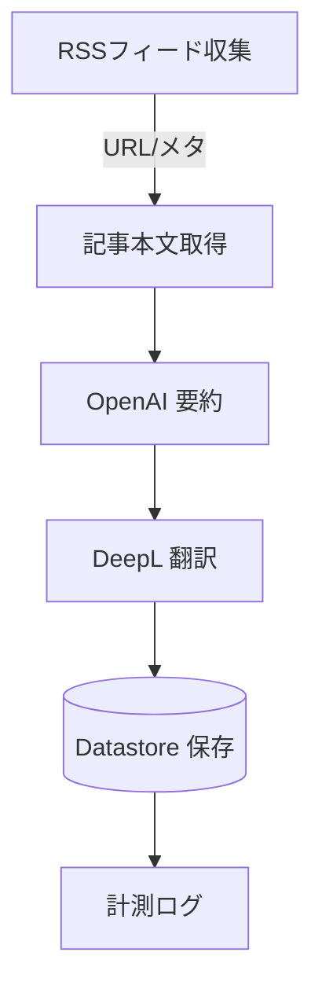

# Datastore 要約パイプライン PoC 設計

## 目的

- RSS から記事を取得し、要約・翻訳した結果を Datastore (`Article` / `Summary`) に保存するジョブを Cloud Run で動作させる。
- Staging での PoC 実行を通じて OpenAI / DeepL のトークン消費とレイテンシを計測し、運用設定（並列度、スケジュール、リトライ）を決定する。

## 想定フロー

1. RSS フィードから未処理の記事 URL を取得（`Article.status == PENDING_FETCH` を目印にする想定）。
2. 記事本文を取得し `Article` を `FETCHED` → `IN_PROGRESS` と更新。
3. OpenAI で英語要約を生成し、DeepL で日本語要約に変換。
4. 結果を `Summary` に書き込み、`Article.status` を `SUMMARIZED` へ更新。
5. トークン使用量・処理時間を計測し、Cloud Logging へ出力。

## 必要リソース

| 種別                 | リソース                          | 備考                                                      |
| -------------------- | --------------------------------- | --------------------------------------------------------- |
| Cloud Run Job        | `techsnap-summarizer`             | Staging/Prod で環境別デプロイ。最大同時実行数は初期値 1。 |
| Secret Manager       | `openai-api-key`, `deepl-api-key` | Cloud Run Job SA が Secret Access を持つ。                |
| Cloud Storage (任意) | `techsnap-summarizer-history`     | 処理ログを保管する場合に利用。                            |
| Datastore            | `Article`, `Summary`              | 既存インデックスを利用。                                  |
| Monitoring           | カスタムメトリクス                | 処理時間/トークンコストを記録。                           |

## サービスアカウントと権限

| サービスアカウント                                       | 付与ロール                                                                        |
| -------------------------------------------------------- | --------------------------------------------------------------------------------- |
| `cloud-run-stg@techsnap-staging.iam.gserviceaccount.com` | `roles/run.invoker`, `roles/datastore.user`, `roles/secretmanager.secretAccessor` |
| `cloud-run-prd@techsnap-prod.iam.gserviceaccount.com`    | 同上                                                                              |

## 環境変数

| 変数名              | 説明                                  |
| ------------------- | ------------------------------------- |
| `OPENAI_API_KEY`    | Secret Manager 参照 (runtime secret)  |
| `DEEPL_API_KEY`     | Secret Manager 参照                   |
| `RSS_FEEDS`         | 監視対象のフィード URL (カンマ区切り) |
| `CONCURRENCY`       | 同時処理数（`1` から開始）            |
| `MAX_ITEMS`         | 1 回のジョブで処理する記事件数        |
| `FETCH_TIMEOUT_MS`  | 記事取得タイムアウト                  |
| `OPENAI_MODEL`      | 使用する要約モデル ID                 |
| `DEEPL_TARGET_LANG` | 翻訳先言語（`JA`）                    |

## 失敗時のハンドリング

| 発生地点           | 対応                                                                                               |
| ------------------ | -------------------------------------------------------------------------------------------------- |
| RSS/Fetch 失敗     | `Article.status` を `FAILED` にし `failureReason` を記録。必要に応じて Cloud Tasks へ再送。        |
| OpenAI エラー      | トークン上限超過などを分類し `summaryAttemptCount` をインクリメント。リトライ回数超過で `FAILED`。 |
| DeepL エラー       | ネットワークエラー時は exponential backoff。翻訳失敗時は `Summary.status` を `FAILED`。            |
| Datastore 書き込み | トランザクション再試行。永続的失敗時は DLQ で人手介入。                                            |

## 観測項目

- Cloud Logging へ以下の JSON ログを出力：
  - `articleUrl`, `status`, `tokensUsed`, `openaiModel`, `durationMs`, `costUsd`
- Cloud Monitoring カスタム指標：
  - `custom.googleapis.com/techsnap/summarizer/latency`
  - `.../summarizer/tokens`
- アラート条件：
  - 5 分平均で失敗率 > 20%
  - 処理レイテンシ > 60 秒

## スケジュール案

- Staging: Cloud Scheduler で 30 分おきに `gcloud run jobs execute techsnap-summarizer-staging`。
- Prod: 本番導入前に 5 件で試験実行 → 夜間 30 分間隔で稼働 → 負荷状況を見ながら調整。

## 今後のタスク

1. 上記設計を Terraform に反映（Cloud Run Job / Secret / IAM）。
2. `apps/jobs/summarizer` の実装（RSS クライアント、要約、翻訳モジュール）。
3. ポスト検証：処理コスト試算、Staging での耐久テスト、Prod ロールアウト手順の策定。
