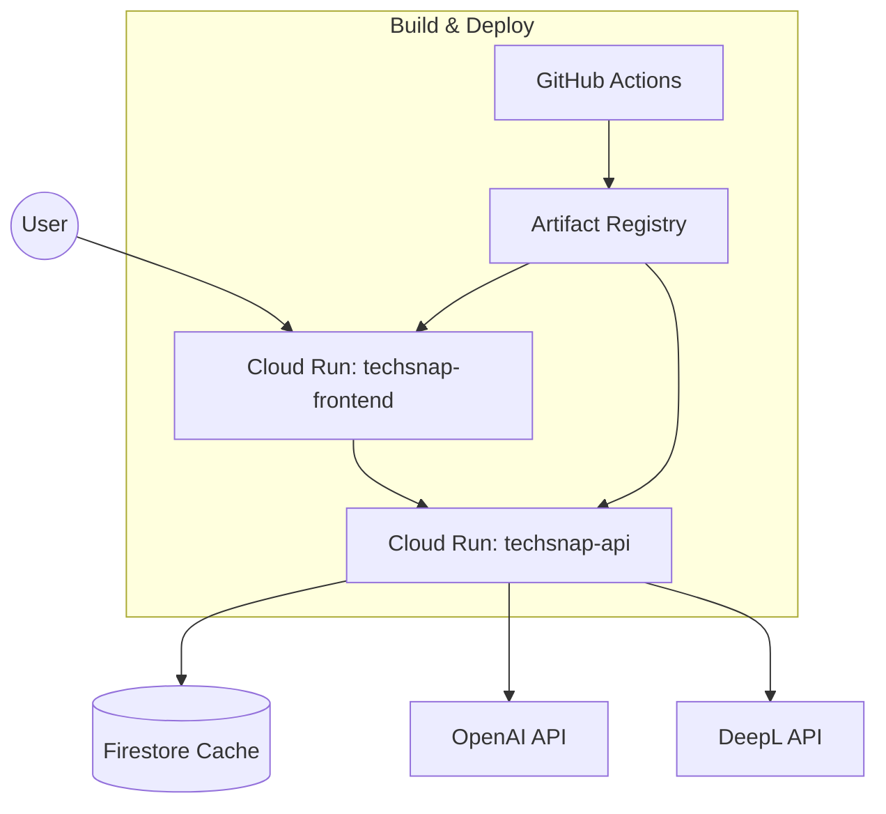

# 設計書

## 概要

技術記事要約サービス「TechSnap」は Next.js + TypeScript を基盤とし、フロントエンドと要約 API をそれぞれ Cloud Run 上のコンテナとして運用します。Firestore をキャッシュストアに利用し、OpenAI / DeepL API を通じて記事要約と翻訳を実現します。

## アーキテクチャ

- `techsnap-frontend`: Next.js の SSR を行うフロントエンド。
- `techsnap-api`: 要約生成・翻訳・キャッシュ書き込みを担当するバックエンド。
- Firestore: フィードと要約のキャッシュ。Admin SDK をサービスアカウントで利用。
- GitHub Actions: Docker イメージのビルドと Cloud Run へのデプロイを自動化。

## データフロー

1. GitHub Actions が `apps/web` / `apps/api` の Docker イメージをビルドし、Artifact Registry に push。
2. Cloud Run へデプロイされた `techsnap-frontend` がユーザーリクエストに応答し、`techsnap-api` へ要約/翻訳をリクエスト。
3. `techsnap-api` は対象記事をフェッチし、OpenAI で英語要約 → DeepL で日本語化 → Firestore に保存。
4. フロントは Firestore キャッシュを優先し、未取得のものは API へ問い合わせ。

## モジュール構成

| モジュール                  | 役割                                                        |
| --------------------------- | ----------------------------------------------------------- |
| `apps/web`                  | Next.js フロントエンド。Cloud Run (frontend) で稼働。       |
| `apps/api`                  | 要約 API（Express など）。Cloud Run (api) で稼働。          |
| `scripts/fetch-feeds.mjs`   | フィード取得とキャッシュ更新（GitHub Actions で定期実行）。 |
| `apps/web/src/lib/server/*` | Firestore / 要約 API との接続ヘルパー。                     |

## 環境

| 環境       | Cloud Run サービス                                   | Artifact Registry                                              | Firestore          | 説明       |
| ---------- | ---------------------------------------------------- | -------------------------------------------------------------- | ------------------ | ---------- |
| staging    | `techsnap-frontend-staging` / `techsnap-api-staging` | `asia-northeast1-docker.pkg.dev/techsnap-staging/techsnap-web` | `techsnap-staging` | 検証用環境 |
| production | `techsnap-frontend-prod` / `techsnap-api-prod`       | `asia-northeast1-docker.pkg.dev/techsnap-prod/techsnap-web`    | `techsnap-prod`    | 本番環境   |

## デプロイ戦略

1. GitHub Actions がブランチ（main / develop など）に応じて Docker イメージをビルド。
2. Artifact Registry に `frontend:staging` `backend:staging` などのタグで push。
3. `gcloud run deploy` を呼び出し、Cloud Run サービスを更新。トラフィックは段階的に切り替え可能。
4. 古いイメージは Artifact Registry のクリーンアップポリシーで自動削除。

## 今後の改善ポイント

- Cloud Load Balancer + Cloud CDN を組み合わせた配信最適化。
- Firestore 以外のキャッシュストア（MemoryStore 等）への移行検討。
- Cloud Run サービス間通信を Identity Token で保護する（内部認証強化）。
