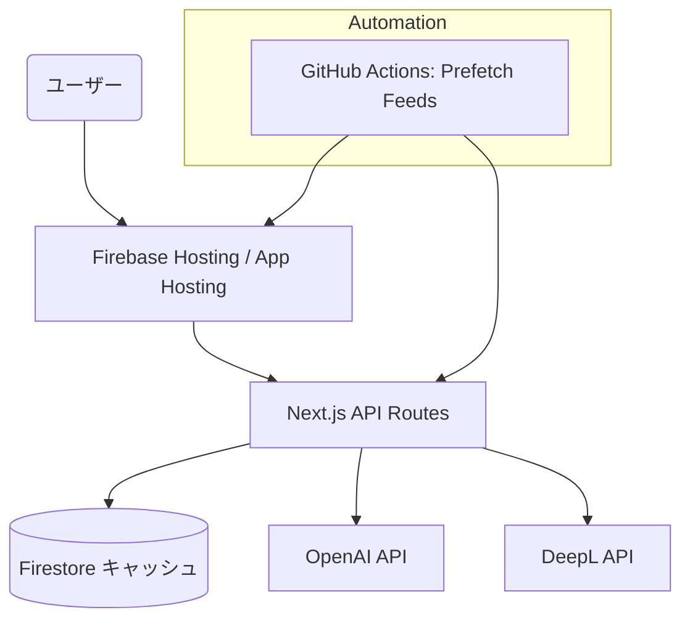

# 設計書

## 概要

技術記事要約サービス「TechSnap」は Next.js (App Router) と Firebase を基盤に構築された個人向けアプリです。RSS/Atom/JSON Feed から収集した更新情報を Firestore にキャッシュし、OpenAI と DeepL を使って日本語要約を生成します。アプリは Firebase Hosting から配信されます。

## アーキテクチャ



### データフロー

1. GitHub Actions（毎時）またはユーザー操作で `scripts/fetch-feeds.mjs` が Firebase Hosting の `/api/feeds` を呼び出し、最新記事を取得。
2. Next.js API が RSS/Atom/JSON Feed を解析し、Firestore `feedCache` / `feedAggregates` に保存。
3. `/api/enrich` が OpenAI で一文要約を生成し、DeepL で翻訳して Firestore に保存。
4. クライアントは `DynamicFeed` コンポーネントで Firestore キャッシュを読み込み、日付ごとに一覧表示する。

## データモデル

```ts
// Firestore: feedCache/{sourceSlug}/snapshots/{dateKey}
type FeedCacheDocument = {
  slug: string;
  dateKey: string; // YYYY-MM-DD
  items: FeedItem[];
  fetchedAt: string; // ISO
  expiresAt: string; // ISO
  etag?: string;
  lastModified?: string;
  endpoint?: string; // 実際に成功した feed URL
};

// Firestore: feedAggregates/{group}/snapshots/{dateKey}
type AggregateCacheDocument = {
  key: string; // group or "all"
  dateKey: string;
  items: FeedItem[];
  fetchedAt: string;
  expiresAt: string;
};

// 表示用
type FeedItem = {
  id: string;
  title: string;
  url: string;
  publishedAt: string;
  sourceSlug: string;
  sourceName: string;
  group?: "development" | "cloud" | "libraries" | "programming";
  kind: "blog" | "docs" | "release";
  tags?: string[];
  summaryJa?: string;
  excerpt?: string;
};
```

## コンポーネント構成

| コンポーネント             | 役割                                                                                                 |
| -------------------------- | ---------------------------------------------------------------------------------------------------- |
| `DynamicFeed`              | API から取得した記事を日付単位にまとめて表示。キャッシュが無い場合はローディング、要約取得もハンドル |
| `FeedList` / `FeedItemRow` | 記事のリストと各行の描画                                                                             |
| `app/api/feeds`            | RSS/Atom/JSON Feed を解析し、Firestore キャッシュを更新・返却                                        |
| `app/api/enrich`           | 要約/翻訳処理を実施し、Firestore に結果を保存                                                        |
| `lib/server/firestore.ts`  | Firebase Admin SDK の初期化ヘルパー                                                                  |
| `lib/server/feedCache.ts`  | Firestore キャッシュ CRUD を集約                                                                     |

## 自動処理

- `.github/workflows/prefetch-feeds.yml` が 60 分ごとに `scripts/fetch-feeds.mjs` を実行。staging / production の Firebase Hosting URL を順番に呼び出し、キャッシュを温める。
- `force_refresh` を指定した手動実行では `refresh=1` クエリが付与され、ETag/Last-Modified に関わらず再取得する。

## 環境と設定

| 環境         | Hosting サイト例                   | Firestore              | 説明                                      |
| ------------ | ---------------------------------- | ---------------------- | ----------------------------------------- |
| 開発         | `localhost:3000`                   | ローカル `.env.local`  | `npm run dev` で実行                      |
| ステージング | `https://techsnap-staging.web.app` | Firestore (staging)    | 動作確認用。GitHub Actions で定期的に更新 |
| 本番         | `https://techsnap-prod.web.app`    | Firestore (production) | 公開用環境                                |

## セキュリティ

- サービスアカウント JSON はローカル `secrets/` と GitHub Secrets で管理する。
- Firestore Rules はキャッシュ読み取りのみ許可し、書き込みはサーバーサイド（Admin SDK）に限定する。
- 外部 API キー（OpenAI, DeepL）は `.env` / Secrets に保存し、コードにハードコードしない。

## 運用メモ

- Firebase Hosting のデプロイ: `npm run build --workspace apps/web` → `firebase deploy --only hosting`
- Firestore キャッシュのリセット: コンソールで該当ドキュメントを削除し、GitHub Actions を `force_refresh=true` で実行。
- API レート制限に達した場合はワークフローを一時停止し、利用状況を確認する。
