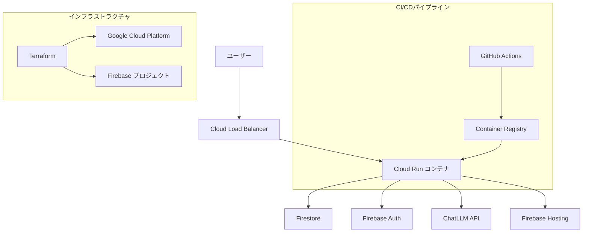
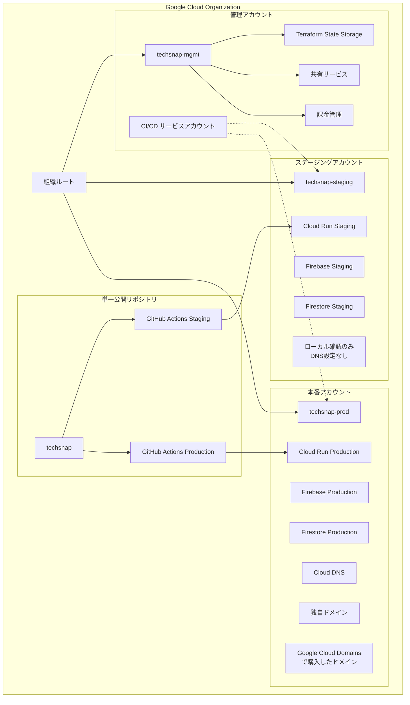

# 設計書

## 概要

技術記事要約サービス「TechSnap」は、Next.js + Firebase + Google Cloud を基盤とした個人利用向け Web アプリケーションです。記事 URL を入力することで、ChatLLM API を活用して記事内容を要約し、効率的な技術情報収集を支援します。

## アーキテクチャ

### システムアーキテクチャ



### マルチアカウント環境アーキテクチャ



## インフラストラクチャ設計

### マルチアカウント構築戦略

#### アカウント構成

| アカウント                                        | 用途                       | 主要リソース                        | アクセス制御        |
| ------------------------------------------------- | -------------------------- | ----------------------------------- | ------------------- |
| **管理アカウント**<br/>`techsnap-mgmt`            | インフラ管理・共有サービス | Terraform State、IAM、課金管理      | 開発者のみ          |
| **ステージングアカウント**<br/>`techsnap-staging` | 開発・テスト環境           | Cloud Run、Firestore、Firebase      | 開発者・CI/CD       |
| **本番アカウント**<br/>`techsnap-prod`            | 本番サービス               | Cloud Run、Firestore、Firebase、DNS | CI/CD・限定アクセス |

#### マルチアカウントの利点

1. **セキュリティ分離**: 環境間の完全な分離によるセキュリティ向上
2. **権限管理**: アカウント別の細かい権限制御
3. **課金分離**: 環境別のコスト管理と可視化
4. **障害影響範囲**: 一つの環境の障害が他に影響しない
5. **コンプライアンス**: 本番環境への厳格なアクセス制御

### ディレクトリ構造（マルチアカウント対応フラット構成）

```bash
terraform/
# 管理アカウント（共通インフラ）
├── google_organization_mgmt.tf          # 組織・フォルダ管理
├── google_billing_mgmt.tf               # 課金アカウント設定
├── google_storage_terraform_state.tf    # Terraformステート管理
├── google_iam_cross_account.tf          # クロスアカウントIAM
├── google_secretmanager_shared.tf       # 共有シークレット管理

# ステージングアカウント
├── google_project_staging.tf            # ステージングプロジェクト
├── google_cloudrun_staging.tf           # Cloud Run ステージング
├── google_firestore_staging.tf          # Firestore ステージング
├── google_iam_staging.tf                # ステージング用IAM
├── google_monitoring_staging.tf         # 監視 ステージング
├── google_logging_staging.tf            # ログ ステージング

# 本番アカウント
├── google_project_prod.tf               # 本番プロジェクト
├── google_cloudrun_prod.tf              # Cloud Run 本番
├── google_firestore_prod.tf             # Firestore 本番
├── google_dns_prod.tf                   # Cloud DNS 本番
├── google_domains_prod.tf               # Google Cloud Domains
├── google_iam_prod.tf                   # 本番用IAM
├── google_monitoring_prod.tf            # 監視 本番
├── google_logging_prod.tf               # ログ 本番
├── google_alerting_prod.tf              # アラート 本番

# 共通設定
├── locals.tf                            # アカウント別定数
├── variables.tf                         # 変数定義
├── outputs.tf                           # 出力値定義
├── provider.tf                          # マルチアカウントプロバイダー
├── versions.tf                          # バージョン制約
└── backend.tf                           # Terraform Backend

# 環境変数（アカウント別）
└── env/
    ├── mgmt.tfvars                      # 管理アカウント変数
    ├── staging.tfvars                   # ステージング変数
    └── production.tfvars                # 本番変数
```

### マルチアカウントプロバイダー設定

```hcl
# provider.tf
terraform {
  required_providers {
    google = {
      source  = "hashicorp/google"
      version = "~> 5.0"
    }
  }
}

# 管理アカウント用プロバイダー
provider "google" {
  alias   = "mgmt"
  project = var.mgmt_project_id
  region  = var.region
}

# ステージングアカウント用プロバイダー
provider "google" {
  alias   = "staging"
  project = var.staging_project_id
  region  = var.region
}

# 本番アカウント用プロバイダー
provider "google" {
  alias   = "prod"
  project = var.prod_project_id
  region  = var.region
}

# Firebase用プロバイダー（アカウント別）
provider "google" {
  alias   = "firebase_staging"
  project = var.staging_project_id
}

provider "google" {
  alias   = "firebase_prod"
  project = var.prod_project_id
}
```

### アカウント別変数管理

```hcl
# locals.tf
locals {
  # 共通設定
  common = {
    region = "asia-northeast1"
    zone   = "asia-northeast1-a"
    labels = {
      project     = "techsnap"
      environment = var.environment
      managed_by  = "terraform"
    }
  }

  # アカウント別設定
  accounts = {
    mgmt = {
      project_id = "techsnap-mgmt"
      purpose    = "management"
      resources = {
        terraform_state_bucket = "techsnap-terraform-state"
        shared_secrets        = true
        billing_management    = true
      }
    }

    staging = {
      project_id = "techsnap-staging"
      purpose    = "development"
      resources = {
        cloud_run_min_instances = 0
        cloud_run_max_instances = 3
        firestore_tier         = "free"
        dns_enabled           = false
        custom_domain         = false
      }
    }

    prod = {
      project_id = "techsnap-prod"
      purpose    = "production"
      resources = {
        cloud_run_min_instances = 1
        cloud_run_max_instances = 10
        firestore_tier         = "paid"
        dns_enabled           = true
        custom_domain         = true
        domain_name           = var.prod_domain_name
      }
    }
  }

  # 環境別Firebase設定
  firebase_config = {
    staging = {
      project_id = local.accounts.staging.project_id
      web_app_name = "techsnap-staging-web"
      hosting_site = "techsnap-staging"
    }
    prod = {
      project_id = local.accounts.prod.project_id
      web_app_name = "techsnap-prod-web"
      hosting_site = "techsnap-prod"
    }
  }
}
```

### クロスアカウント IAM 設定

```hcl
# google_iam_cross_account.tf
# CI/CDサービスアカウント（管理アカウントで作成）
resource "google_service_account" "cicd_sa" {
  provider     = google.mgmt
  account_id   = "techsnap-cicd"
  display_name = "TechSnap CI/CD サービスアカウント"
  description  = "GitHub ActionsからのデプロイとTerraform実行用"
}

# ステージングアカウントへのアクセス権限
resource "google_project_iam_member" "cicd_staging_editor" {
  provider = google.staging
  project  = local.accounts.staging.project_id
  role     = "roles/editor"
  member   = "serviceAccount:${google_service_account.cicd_sa.email}"
}

# 本番アカウントへのアクセス権限（制限付き）
resource "google_project_iam_member" "cicd_prod_deployer" {
  provider = google.prod
  project  = local.accounts.prod.project_id
  role     = "roles/run.developer"
  member   = "serviceAccount:${google_service_account.cicd_sa.email}"
}

resource "google_project_iam_member" "cicd_prod_firebase" {
  provider = google.prod
  project  = local.accounts.prod.project_id
  role     = "roles/firebase.admin"
  member   = "serviceAccount:${google_service_account.cicd_sa.email}"
}

# Terraformステートアクセス権限
resource "google_storage_bucket_iam_member" "cicd_terraform_state" {
  provider = google.mgmt
  bucket   = google_storage_bucket.terraform_state.name
  role     = "roles/storage.admin"
  member   = "serviceAccount:${google_service_account.cicd_sa.email}"
}
```

### 環境変数管理戦略（マルチアカウント）

```bash
# Cloud Storageでの.tfvarsファイル管理（管理アカウント）
gs://techsnap-terraform-state/
├── terraform.tfstate                    # Terraformステートファイル
├── env/
│   ├── mgmt.tfvars                     # 管理アカウント変数
│   ├── staging.tfvars                  # ステージング変数
│   └── production.tfvars               # 本番変数
├── secrets/
│   ├── mgmt/                           # 管理アカウント機密情報
│   ├── staging/                        # ステージング機密情報
│   └── production/                     # 本番機密情報
└── cross-account/
    ├── service-account-keys/           # クロスアカウントサービスアカウントキー
    └── shared-configs/                 # 共有設定ファイル
```

### デプロイ戦略（マルチアカウント）

```bash
# Terraformワークスペース別実行
# 管理アカウント（初回のみ）
terraform workspace new mgmt
terraform apply -var-file="env/mgmt.tfvars" -target="google_organization_*" -target="google_billing_*"

# ステージングアカウント
terraform workspace new staging
terraform apply -var-file="env/staging.tfvars" -target="google_project_staging" -target="google_*_staging"

# 本番アカウント
terraform workspace new prod
terraform apply -var-file="env/production.tfvars" -target="google_project_prod" -target="google_*_prod"
```

## コンポーネントとインターフェース

### フロントエンドコンポーネント（Next.js）

#### 1. 記事入力コンポーネント

- **責務**: 記事 URL 入力とバリデーション
- **プロパティ**: `onSubmit: (url: string) => void`
- **状態**: `url: string, isValidating: boolean, error: string | null`

#### 2. 要約表示コンポーネント

- **責務**: 要約結果の表示とアクション
- **プロパティ**: `summary: Summary, onSave: () => void, onShare: () => void`
- **状態**: `isExpanded: boolean, isSaving: boolean`

#### 3. 要約一覧コンポーネント

- **責務**: 保存済み要約の一覧表示
- **プロパティ**: `summaries: Summary[], onSelect: (id: string) => void`
- **状態**: `searchQuery: string, filteredSummaries: Summary[]`

#### 4. レイアウトコンポーネント

- **責務**: 共通レイアウトとナビゲーション
- **プロパティ**: `children: ReactNode, title?: string`
- **状態**: `theme: 'light' | 'dark', isMenuOpen: boolean`

### バックエンドサービス（Firebase Functions）

#### 1. 記事スクレイピングサービス

```typescript
interface ArticleScraperService {
  scrapeArticle(url: string): Promise<ArticleContent>;
  validateUrl(url: string): boolean;
}

interface ArticleContent {
  title: string;
  content: string;
  author?: string;
  publishedAt?: Date;
  tags: string[];
}
```

#### 2. 要約サービス

```typescript
interface SummaryService {
  generateSummary(content: ArticleContent): Promise<Summary>;
  saveSummary(summary: Summary, userId: string): Promise<string>;
  getSummaries(userId: string): Promise<Summary[]>;
  deleteSummary(summaryId: string, userId: string): Promise<void>;
}

interface Summary {
  id: string;
  title: string;
  originalUrl: string;
  summary: string;
  tags: string[];
  createdAt: Date;
  userId: string;
}
```

#### 3. ChatLLM 統合サービス

```typescript
interface ChatLLMService {
  summarizeText(text: string, options?: SummaryOptions): Promise<string>;
  extractTags(text: string): Promise<string[]>;
}

interface SummaryOptions {
  maxLength?: number;
  language?: "ja" | "en";
  style?: "technical" | "general";
}
```

### API エンドポイント

#### REST API 設計

```bash
GET    /api/summaries          # 要約一覧取得
POST   /api/summaries          # 新規要約作成
GET    /api/summaries/:id      # 特定要約取得
DELETE /api/summaries/:id      # 要約削除
POST   /api/articles/scrape    # 記事スクレイピング
```

## データモデル

### Firestore コレクション

#### ユーザーコレクション

```typescript
interface User {
  uid: string;
  email: string;
  displayName?: string;
  createdAt: Timestamp;
  lastLoginAt: Timestamp;
  preferences: {
    theme: "light" | "dark";
    language: "ja" | "en";
    summaryStyle: "technical" | "general";
  };
}
```

#### 要約コレクション

```typescript
interface Summary {
  id: string;
  userId: string;
  title: string;
  originalUrl: string;
  summary: string;
  tags: string[];
  metadata: {
    author?: string;
    publishedAt?: Timestamp;
    scrapedAt: Timestamp;
    wordCount: number;
  };
  createdAt: Timestamp;
  updatedAt: Timestamp;
}
```

#### キャッシュコレクション（パフォーマンス向上用）

```typescript
interface ArticleCache {
  urlHash: string;
  content: ArticleContent;
  cachedAt: Timestamp;
  expiresAt: Timestamp;
}
```

## エラーハンドリング

### エラータイプとハンドリング戦略

#### 1. クライアントサイドエラー

```typescript
enum ClientErrorType {
  INVALID_URL = "INVALID_URL",
  NETWORK_ERROR = "NETWORK_ERROR",
  AUTHENTICATION_ERROR = "AUTHENTICATION_ERROR",
  VALIDATION_ERROR = "VALIDATION_ERROR",
}

interface ErrorHandler {
  handleError(error: ClientErrorType, context?: any): void;
  showUserFriendlyMessage(error: ClientErrorType): string;
}
```

#### 2. サーバーサイドエラー

```typescript
enum ServerErrorType {
  SCRAPING_FAILED = "SCRAPING_FAILED",
  LLM_API_ERROR = "LLM_API_ERROR",
  DATABASE_ERROR = "DATABASE_ERROR",
  RATE_LIMIT_EXCEEDED = "RATE_LIMIT_EXCEEDED",
}

interface ErrorResponse {
  error: {
    type: ServerErrorType;
    message: string;
    code: number;
    details?: any;
  };
}
```

#### 3. エラー回復メカニズム

- **リトライロジック**: LLM API 呼び出し失敗時の指数バックオフ
- **フォールバック**: スクレイピング失敗時の代替手段
- **サーキットブレーカー**: 外部 API 障害時の保護機能
- **グレースフルデグラデーション**: 機能制限での継続サービス提供

## テスト戦略

### テストピラミッド

#### 1. ユニットテスト（70%）

- **フロントエンド**: React Component Testing Library
- **バックエンド**: Jest + Firebase Emulator
- **カバレッジ目標**: 80%以上

#### 2. 統合テスト（20%）

- **API 統合**: Supertest + Firebase Emulator
- **データベース統合**: Firestore Emulator
- **外部 API モック**: ChatLLM API モック

#### 3. E2E テスト（10%）

- **ツール**: Playwright
- **シナリオ**:
  - 記事 URL 入力から要約生成まで
  - 要約保存と一覧表示
  - 認証フロー

### テスト環境セットアップ

```yaml
# firebase.json（エミュレーター設定）
{
  "emulators":
    {
      "auth": { "port": 9099 },
      "firestore": { "port": 8080 },
      "functions": { "port": 5001 },
      "hosting": { "port": 5000 },
    },
}
```

## セキュリティ設定

### 1. IAM ロールと権限

```hcl
# Cloud Runサービスアカウント
resource "google_service_account" "cloud_run_sa" {
  account_id   = "techsnap-run"
  display_name = "TechSnap Cloud Run サービスアカウント"
}

# Firestore権限
resource "google_project_iam_member" "firestore_user" {
  project = var.project_id
  role    = "roles/datastore.user"
  member  = "serviceAccount:${google_service_account.cloud_run_sa.email}"
}
```

### 2. ネットワークセキュリティ

- **VPC**: プライベートネットワーク構成
- **Cloud Armor**: DDoS 保護と WAF
- **SSL/TLS**: 自動証明書管理

### 3. シークレット管理

```hcl
# ChatLLM APIキー
resource "google_secret_manager_secret" "chatllm_api_key" {
  secret_id = "chatllm-api-key"

  replication {
    automatic = true
  }
}
```

## パフォーマンス最適化

### キャッシュ戦略

#### 1. クライアントサイドキャッシュ

- **Next.js SWR**: API レスポンスキャッシュ
- **ブラウザキャッシュ**: 静的アセット（24 時間）
- **Service Worker**: オフライン対応

#### 2. サーバーサイドキャッシュ

- **Firestore キャッシュ**: 記事コンテンツ（7 日間）
- **Cloud CDN**: 静的コンテンツ配信
- **メモリキャッシュ**: 頻繁にアクセスされる要約

#### 3. データベース最適化

```typescript
// Firestore複合インデックス
const summariesIndex = {
  collectionGroup: "summaries",
  fields: [
    { fieldPath: "userId", order: "ASCENDING" },
    { fieldPath: "createdAt", order: "DESCENDING" },
  ],
};
```

### 監視と可観測性

#### 1. アプリケーション監視

- **Google Cloud Monitoring**: メトリクス収集
- **Cloud Logging**: 構造化ログ
- **Error Reporting**: エラー追跡

#### 2. パフォーマンスメトリクス

```typescript
// 主要パフォーマンス指標
interface PerformanceMetrics {
  summaryGenerationTime: number; // 目標: 3秒以内
  apiResponseTime: number; // 目標: 500ms以内
  errorRate: number; // 目標: 1%以下
  userSatisfactionScore: number; // 目標: 4.5/5以上
}
```

#### 3. アラート戦略

- **高エラー率**: 5%を超えた場合
- **レスポンス遅延**: 平均レスポンス時間が 1 秒を超えた場合
- **リソース使用量**: CPU 使用率が 80%を超えた場合
- **コストアラート**: 月額予算の 80%に達した場合
